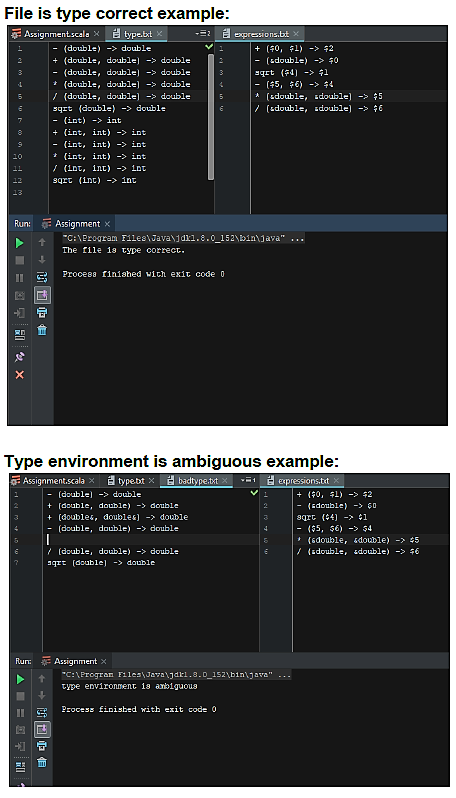
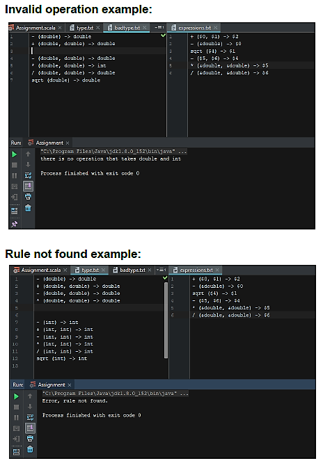

# Type checker in Scala
1. Project title
    * Type checker in Scala
2. Project Description
    * A type checker for a statically typed language with a strong type system. The language allows
overloading of operators and functions. Ensures that operations or functions are present to carry out a computation and disallows type coercion.
3. Author
    * John Stephenson
4. Screenshots/Sample Session
    * Test Cases
        *    
        *       
5. Contact Information
    * johnds39@uab.edu
